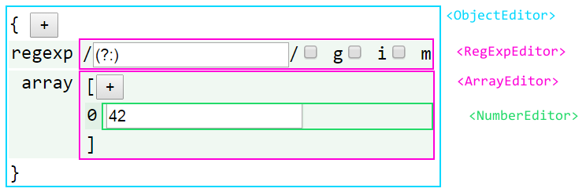
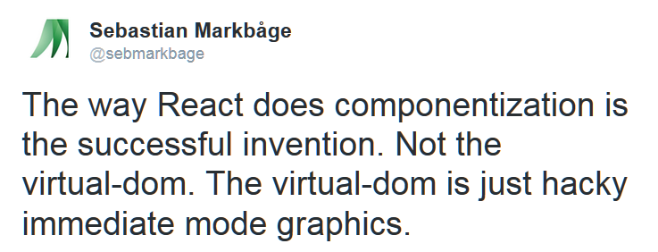
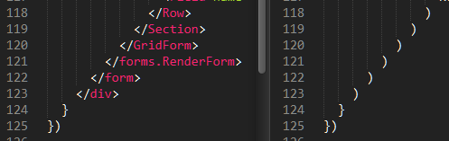
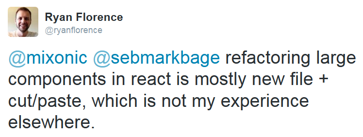
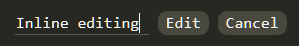

:title: React Components
:author: Jonny Buchanan
:css: talk.css
:js-body: examples.js
:skip-help: true
:pygments: monokai

----

React
=====

.. image:: react-logo.png

Components
==========

----

* What is React?
* What is a React component?
* Component "types"
* Reusable components
* The obligatory "OMG WebSockets" bit

----

What is React?
==============

In its own words...

    React is a JavaScript library for building user interfaces.

----

:id: justtheui

Just the UI
===========

    Lots of people use React as the V in MVC.

* This is carefully worded! (`More on that later... <#/justthev>`_)

* If you've ever used a DOM builder, rendering with React will feel familiar.

* It also solves some of the problems you'll have encountered.

----

Virtual DOM
===========

    React uses a virtual DOM diff implementation for ultra-high performance.

    It can also render on the server using Node.js — no heavy browser DOM required.

Sweet!

----

Data flow
=========

    React implements one-way reactive data flow which reduces boilerplate and is
    easier to reason about than traditional data binding.

----

What is a React component?
===========================

----

A chunk of UI
=============

----

(React dev)

----

A component renders by returning a single ``ReactElement``

.. code:: javascript

   var HelloWorld = React.createClass({
     render() {
       return <h1>Hello world!</h1>
     }
   })

----

:data-x: r0
:data-y: 1600
:data-z: 1600
:data-rotate-x: 90

Aside: JSX
==========

.. code:: html

   <h1>Hello world!</h1>

...is equivalent to...

.. code:: javascript

   React.createElement('div', null, 'Hello world!')

* Transpilaton is done with an in-browser transformer (for quick prototyping)
  or a build step.

* Also supports ES6 transforms!

----

:data-y: r0
:data-z: 3200

"Give it 5 minutes"...

...it'll give you them back later, plus interest.

----

:data-x: r1600
:data-y: 0
:data-z: 0
:data-rotate-x: 0

A component takes ``props``

.. code:: javascript

   var Bulb = React.createClass({
     getDefaultProps() {
       return {on: false}
     },
     render() {
       var status = this.props.on ? 'on' : 'off'
       return 
     }
   })

(Treat them as if they're immutable)

----

:data-x: r0
:data-y: -1600
:data-z: 1600
:data-rotate-x: -90

.. code:: javascript

   <Bulb on={false}/>

.. raw:: html

   

.. code:: javascript

   <Bulb on={true}/>

.. raw:: html

   

----

:data-x: r1600
:data-y: 0
:data-z: 0
:data-rotate-x: 0

* Prop passing is what gives you the one-way data flow.

* Props flow down the component hierarchy.

* With JSX, using components feels like using custom elements.

* As good a fit for a component being "a chunk of UI" as you could hope for?

----

:data-x: r1600
:data-y: r0

A component manages its own mutable ``state``

.. code:: javascript

   var StatefulSwitch = React.createClass({
     getInitialState() {
       return {on: false}
     },
     toggle() {
       var on = !this.state.on
       this.setState({on})
     },
     render() {
       var status = this.state.on ? 'on' : 'off'
       return <button type="button" onClick={this.toggle}>
         {status}
       </button>
     }
   })

----

:data-x: r0
:data-y: -1600
:data-z: 1600
:data-rotate-x: -90

.. code:: javascript

   <StatefulSwitch/>

.. raw:: html

   

----

:data-x: r1600
:data-y: 0
:data-z: 0
:data-rotate-x: 0

Simple inter-component communication via callback props

.. code:: javascript

   var Switch = React.createClass({
     propTypes: {
       on: React.PropTypes.bool.isRequired
     },
     toggle() {
       this.props.onChange(!this.props.on)
     },
     render() {
       var status = this.props.on ? 'on' : 'off'
       return <button type="button" onClick={this.toggle}>
         {status}
       </button>
     }
   })

----

:data-x: r1600
:data-y: r0

Pass a callback down as a prop.

.. code:: javascript

   <Switch onChange={this.onSwitchChanged}/>

Call it to communicate changes back up.

----

A component has lifecycle hooks

.. code:: javascript

   React.createClass({
     // About to render for the first time
     componentWillMount() { ... },
     // Rendered for the first time
     componentDidMount() { ... },
     // Receiving new props - a chance to react to changes
     componentWillReceiveProps(nextProps) { ... },
     // A chance to cancel re-rendering - defaults to true
     shouldComponentUpdate(nextProps, nextState) { ... },
     // About to re-render
     componentWillUpdate(nextProps, nextState) { ... },
     // Finished re-rendering
     componentDidUpdate(prevProps, prevState) { ... },
     // About to be removed
     componentWillUnmount() { ... }
   })

----

Putting it all together: composition

.. code:: javascript

   var Room = React.createClass({
     getInitialState() {
       return {switchOn: false}
     },
     onSwitchChanged(switchOn) {
       this.setState({switchOn})
     },
     render() {
       return 

         <Bulb on={this.state.switchOn}/>
         <Switch
           on={this.state.switchOn}
           onChange={this.onSwitchChanged}
         />
       

     }
   })

.. note::

   Here we have a stateful Room component which manages some "switchOn" state

   It passes that state as a prop to Bulb and Switch

   It also passes Switch a callback function so it can let Room know when the
   user has clicked the button and what the new "on" state should be.

----

:id: composition-example
:data-x: r0
:data-y: r0
:data-z: 1600
:data-rotate-x: -90

----

:id: after-composition-example
:data-x: r1600
:data-y: r0
:data-z: 0
:data-rotate-x: 0

Component "types"
=================

A component is a component is a component...

...but they naturally end up playing different roles in React apps:

* Top-level "controller" components
* App/model specific structural/organisation components
* Reusable components

These are just emergent properties of building apps with components, rather than
baked-in framework concepts.

----

:id: justthev
:data-x: r1600
:data-y: 0

.. raw:: html

   

----

:id: after-justthev

..

   Leaf components are going to be mostly views, and as you go up the hierarchy
   they are going to look more and more like controllers.

   ...unfortunately, if you haven't played with React yet, this *looks* like a
   terrible idea and is a show-stopper for a lot of people...

   Since we want people to try it out, we downplayed [controllers] in our
   marketing talks.

   -- `@vjeux <https://groups.google.com/d/msg/reactjs/sB6IPgiXGe4/1os3fnQRAegJ>`_ (React dev)

----

Refactoring components
======================

(applies to components of all sizes!)

.. note::

   Before example: CrucibleStats.jsx
      ~30 pieces of state and a similar number of methods - albeit organised for
      extraction.

   After example: `DinnerTime.jsx`_
      Also an example of a simple "controller" component implemented like a
      state machine, coordinating app-specific structural components.

   .. _`DinnerTime.jsx`: https://github.com/insin/dinnertime/blob/master/src/DinnerTime.jsx

----

Extracting components
=====================

#. Cut and paste into a new module - any component-specific state, props,
   methods & render() code.

#. Pass any other ``state`` the component depended on as props.

#. Pass callback props in lieu of ``setState()``.

#. Add more props with defaults to the component as required for customisation.

(beware YAGNI!)

----

Reusable components
===================

* Components which act like black boxes.

* The user need only know which props they expect.

* Usually take callback props to communicate back with their containing component.

* Might also expose some public methods if data needs to be pulled from them.

* For editing components: a ``value``/``onChange`` protocol is becoming common.

----

Reusable component example
==========================

``<EditInput/>``

A text input with submit & cancel buttons which handles keyboard events to finish

(`extracted <https://github.com/insin/reactodo/commit/79d7dbac1061a96603c12f21bad61fc69081ff92>`_
from `Reactodo <http://insin.github.io/reactodo/>`_)

----

:id: reusable-example
:data-x: r0
:data-y: r0
:data-z: 1600
:data-rotate-x: -90

.. note::

   Source: [EditInput.jsx](https://github.com/insin/talks/tree/master/belfast-js-2014-12/EditInput.jsx)

   Note this doesn't work nicely embedded here because impress.js and Hovercraft!
   have already registered key event handlers on the document, such as space, left
   right and p.

   React.js uses event delegation for performance, registering a single event
   handler at the top of the real DOM, so we can't prevent the event from
   bubbling up.

----

:id: omg
:data-x: r1600
:data-y: r0
:data-z: 0
:data-rotate-x: 0

The obligatory "OMG\* WebSockets" bit
=====================================

\* OMG-ness may vary by network connectivity

----

Mixins
======

Components also support mixins as a means of code reuse.

* Mixins are objects which have their properties merged into the component's
  prototype.

* React will also ensure that any lifecycle methods in mixins get called too.

----

``ReactFireMixin``
==================

Firebase provides a mixin for React components

.. code:: javascript

   var Comment = React.createClass({
     mixins: [ReactFireMixin],
     getInitialState() {
       return {comment: {}}
     },
     componentDidMount() {
       var {id} = this.props
       this.bindAsObject(
         new Firebase(`${BASE_URL}/items/${id}`),
         'comment'
       )
     },
     render() { /* ... */ }
   })

----

react-hn
========

I used this to implement react-hn, using the Hacker News Firebase API.

`insin.github.io/react-hn <http://insin.github.io/react-hn>`_

* Almost everything is live.

* Re-rendering happens automagically.

* Lifecycle hooks are used to detect loading of new comments.

* A CommentThread model is built up as comments pop in.

* ``react-router`` handles routing - simple and powerful.

----

Start hacking today!

.. code:: html

   <!DOCTYPE html>
   <head>
     <meta charset="UTF-8">
     
     
   </head>
   <body>
     
   </body>

.. code:: javascript

   var App = React.createClass({
     render() { return 

 }
   })
   React.render(<App/>, document.body)

----

Resources
=========

* `Thinking in React <http://facebook.github.io/react/docs/thinking-in-react.html>`_
* `React Training (rpflorence/react-training) <https://github.com/rpflorence/react-training>`_

  * Highly recommended!

* `react-router (rackt/react-router) <https://github.com/rackt/react-router>`_
* `ReactFireMixin (firebase/reactfire) <https://github.com/firebase/reactfire>`_
* `JSX Compiler Service <http://facebook.github.io/react/jsx-compiler.html>`_

  * Get comfy with JSX & ES6 transforms

`jbscript@twitter <https://twitter.com/jbscript>`_ /
`insin@github <https://github.com/insin>`_ /
`talk source <https://github.com/insin/talks/belfast-js-2014-12>`_
